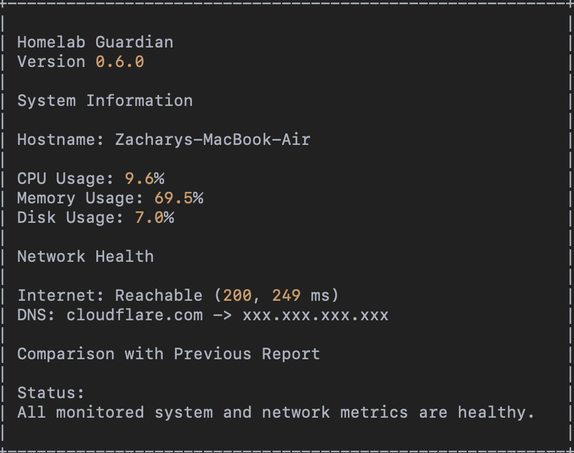
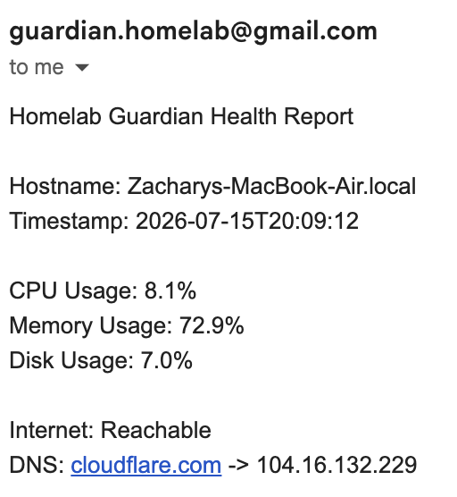

# Homelab Guardian


Homelab Guardian is a lightweight Python monitoring and alerting tool that I am building for my personal homelab.

The project currently runs locally on macOS while I prepare my Unraid server. It collects system and network health data, compares current metrics against previous runs, writes structured reports and logs, and sends email notifications through Gmail.

## Current Release

**Version:** `0.6.5`

## Features

- CPU utilization monitoring
- Memory utilization monitoring
- Disk utilization monitoring
- Internet reachability checks
- HTTP status and response-time tracking
- DNS resolution checks
- Configurable warning thresholds
- Historical comparison with the previous health report
- Timestamped JSON reports
- Persistent application logging
- Gmail email notifications
- Healthy and warning notification modes
- Environment-variable protection for credentials
- Clear application exit codes and error handling
- Top CPU process diagnostics
- Top memory process diagnostics
- Process IDs and resource usage in reports
- Process diagnostics included in email notifications

## Architecture

```text
                    Homelab Guardian
                           |
                           v
                  Load Configuration
             settings.json + local .env
                           |
                           v
                Collect System Metrics
                 |- CPU utilization
                 |- Memory utilization
                 |- Disk utilization
                 |- Top CPU processes
                 `- Top memory processes
                           |
                           v
                Collect Network Health
                 |- Internet reachability
                 |- HTTP response time
                 `- DNS resolution
                           |
                           v
               Compare Previous Report
                           |
                           v
              Evaluate Warning Thresholds
                           |
          +----------------+----------------+
          |                |                |
          v                v                v
     JSON Report      Application Log    Email Alert
```

Current development and testing runs locally on macOS. Future versions will deploy to Unraid and expand into Docker, Immich, Tailscale, and backup monitoring.

## Screenshots

### Terminal Health Report



### Gmail Notification



## Example Output

```text
====================================================
                  Homelab Guardian
                   Version 0.6.0
====================================================

System Information
----------------------------------------------------
Hostname:          Zacharys-MacBook-Air.local
Operating System:  macOS
Python Version:    3.9.6

System Health
----------------------------------------------------
CPU Usage:         9.6%
Memory Usage:      69.5%
Disk Usage:        7.0%

Network Health
----------------------------------------------------
Internet:          Reachable (200, 249.2 ms)
DNS:               cloudflare.com -> 104.16.132.229

Comparison with Previous Report
----------------------------------------------------
CPU          5.0% -> 9.6% (+4.6%, increased)
Memory      69.5% -> 69.5% (0.0%, unchanged)
Disk         7.0% -> 7.0% (0.0%, unchanged)

Status
----------------------------------------------------
All monitored system and network metrics are healthy.
====================================================
```

## Project Structure

```text
Homelab-Guardian/
├── config/
│   └── settings.json
├── docs/
│   ├── architecture.md
│   └── roadmap.md
├── logs/
├── powershell/
│   └── Get-SystemHealth.ps1
├── sample-output/
├── src/
│   ├── backup_manager.py
│   └── guardian.py
├── tests/
├── .env.example
├── .gitignore
├── LICENSE
├── README.md
└── requirements.txt
```

## Requirements

- Python 3.9 or newer
- `psutil`
- `python-dotenv`

## Installation

Clone the repository:

```bash
git clone https://github.com/hidalgozachary/Homelab-Guardian.git
cd Homelab-Guardian
```

Create and activate a virtual environment:

```bash
python3 -m venv .venv
source .venv/bin/activate
```

Install dependencies:

```bash
python -m pip install -r requirements.txt
```

## Configuration

System thresholds and application settings are stored in:

```text
config/settings.json
```

Example:

```json
{
  "guardian_name": "Homelab Guardian",
  "version": "0.6.0",
  "warning_thresholds": {
    "cpu_percent": 80,
    "memory_percent": 80,
    "disk_percent": 85
  }
}
```

## Email Notifications

Copy `.env.example` to `.env`:

```bash
cp .env.example .env
```

Add your local Gmail notification settings:

```text
GUARDIAN_EMAIL_FROM=guardian.homelab@gmail.com
GUARDIAN_EMAIL_TO=your_email@gmail.com
GUARDIAN_EMAIL_APP_PASSWORD=your_app_password
```

The `.env` file is excluded from Git and must never be committed.

## Usage

Run Homelab Guardian from the repository root:

```bash
python src/guardian.py
```

The application will:

1. Collect system and network metrics.
2. Compare them with the previous report.
3. Evaluate configured warning thresholds.
4. Save a timestamped JSON report.
5. Write operational logs.
6. Send an email notification when enabled.

## Roadmap

### Completed

- [x] System health monitoring
- [x] Configurable warning thresholds
- [x] Persistent logging
- [x] Historical report comparisons
- [x] Internet and DNS health checks
- [x] Gmail email notifications
- [x] Top CPU process diagnostics
- [x] Top memory process diagnostics
- [x] Automated tests
- [x] GitHub Actions CI

### Planned

- [ ] Scheduled hourly execution
- [ ] Discord webhook notifications
- [ ] Docker container monitoring
- [ ] Backup validation
- [ ] Unraid deployment
- [ ] Immich service monitoring
- [ ] Tailscale connectivity checks
- [ ] HTML health reports
- [ ] Historical charts
- [ ] AI-assisted summaries

## Security

This repository does not contain:

- Passwords
- API keys
- App passwords
- Access tokens
- Private infrastructure addresses
- Employer-owned code or documentation

Environment-specific secrets are stored locally and excluded from source control.

## Development Approach

Each feature is built using the same process:

1. Define the operational problem.
2. Build a small working version.
3. Test it locally.
4. Add error handling and logging.
5. Document the feature.
6. Commit the completed change to Git.
7. Expand it for the future Unraid environment.

## Author

**Zachary Hidalgo**

Production Support Engineer focused on cloud infrastructure, automation, healthcare technology, and reliable production operations.
