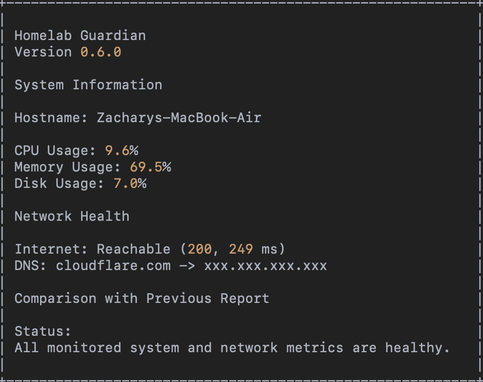
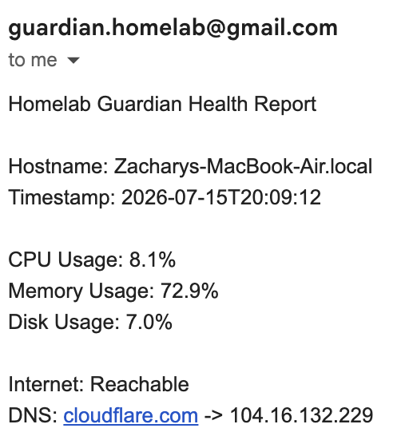

# 🐼 Homelab Guardian

[](https://github.com/hidalgozachary/Homelab-Guardian/actions/workflows/python.yml)


Homelab Guardian is a modular Python infrastructure monitoring and operations application for self-hosted environments.

It collects operational data through independent collectors, evaluates overall health, produces consistent reports, and delivers alerts through supported notification channels.

The first production target is **PandaServer**, a personal Unraid server that will use Homelab Guardian to monitor host health, storage, Docker workloads, services, networking, and backups.

> Homelab Guardian is under active development.  
> Version `0.8.0` is not yet production-validated on Unraid.

---

## Project Status

### Stable foundation

Current stable application foundation:

```text
v0.8.0
```

### Current development

Active development milestone:

```text
v0.8.0 — PandaServer Integration
```

Current development includes:

- Modular Python package architecture
- Standard collector execution framework
- Platform-neutral host collection
- Initial Unraid platform detection
- Array and cache capacity collection
- Storage filesystem and mount metadata
- Read-only block-device inventory
- Centralized health scoring
- Terminal reports
- JSON reports
- Discord webhook support
- Gmail notification support
- Automated tests
- GitHub Actions continuous integration
- Architecture and engineering documentation

### Next production milestone

```text
v0.9.0 — PandaServer Deployment and Validation
```

Version `0.9.0` will install and test Homelab Guardian directly on PandaServer through Unraid User Scripts before the project advances to `v1.0.0`.

---

## Why Homelab Guardian?

Self-hosted systems often use several separate monitoring tools:

- Unraid notifications
- Uptime Kuma
- Docker health checks
- Discord webhooks
- Backup applications
- Grafana and Prometheus
- Service-specific dashboards

These tools are useful, but they do not always provide one consolidated answer to the most important operational question:

> Is the homelab operating normally, and is any action required?

Homelab Guardian is being designed to provide that single operational view while preserving native monitoring systems as independent safety layers.

It is not intended to replace Unraid alerts, Uptime Kuma, Prometheus, or other specialized tools.

---

## Core Principles

Homelab Guardian follows several engineering principles:

- One source of truth for operational health
- Independent collectors
- Graceful degradation
- Clear separation of responsibilities
- Read-only collection by default
- Configuration instead of hardcoding
- No secrets committed to source control
- Automated tests for new behavior
- Documentation as part of every feature
- Explicit installation and rollback procedures

Collector failures should be reported honestly without crashing the entire application.

For example:

```text
Host Collector       COLLECTED
Unraid Collector     COLLECTED
Storage Collector    COLLECTED
Docker Collector     FAILED
Backup Collector     NOT IMPLEMENTED
```

---

## Architecture

Homelab Guardian uses a layered architecture:

```text
                    Configuration
                          │
                          ▼
                     Collectors
                          │
                          ▼
                  Collector Runner
                          │
                          ▼
                  Health Scoring
                          │
                          ▼
              Operational Report Model
                          │
          ┌───────────────┼───────────────┐
          ▼               ▼               ▼
      Terminal           JSON        Notifications
                                          │
                                  ┌───────┴───────┐
                                  ▼               ▼
                              Discord           Gmail
```

### Collectors

Collectors gather data only.

Current collector domains include:

```text
Host
Network
Unraid
Storage
```

Planned collector domains include:

```text
Docker
Services
Backups
```

### Scoring

The health-scoring engine evaluates collected data and produces:

- Health status
- Health score
- Issue list
- Issue summary

### Reports

Report renderers present already-collected and already-scored information.

Current report formats include:

- Terminal
- JSON
- Discord operational summary

### Notifications

Notification modules deliver reports.

They do not collect infrastructure data or calculate health independently.

---

## Current Collector Capabilities

### Host Collector

The platform-neutral Host Collector gathers:

- Hostname
- Operating system
- Platform
- Kernel
- Architecture
- Python version
- CPU model
- Logical CPU threads
- Physical CPU cores
- CPU utilization
- CPU temperature when supported
- Memory utilization
- Swap utilization
- Uptime
- Boot time
- Load average

This collector works on macOS during development and is designed to work on Linux and Unraid.

### Unraid Collector

The initial Unraid Collector gathers:

- Unraid platform detection
- Unraid version
- Array state
- Host availability status

On non-Unraid systems it returns:

```text
UNAVAILABLE
```

rather than failing the application.

### Storage Collector

The Storage Collector currently gathers:

- Array capacity
- Array utilization
- Cache capacity
- Cache utilization
- Filesystem type
- Mounted device
- Mount point
- Mount options
- Read-only block-device inventory
- Device name
- Device path
- Device type
- Model
- Serial
- Capacity
- Filesystem
- Mount points
- Conservative inferred device role

SMART health, temperatures, parity assignments, and authoritative Unraid device-role mapping are planned next.

### Network Monitoring

Current network checks include:

- Internet reachability
- HTTP response status
- Response time
- DNS resolution

---

## Collector Result Contract

Every framework-based collector returns the same result structure:

```json
{
  "name": "storage",
  "status": "COLLECTED",
  "available": true,
  "data": {},
  "error": null
}
```

Current statuses include:

```text
COLLECTED
UNAVAILABLE
FAILED
NOT_IMPLEMENTED
```

This allows one collector to fail without terminating the entire report.

---

## Current Example

Development execution currently produces output similar to:

```text
================================================
                Homelab Guardian
                 Version 0.8.0
================================================

Overall Health
------------------------------------------------
Status:            HEALTHY
Health Score:      100 / 100

System Information
------------------------------------------------
Hostname:          development-host
Operating System:  macOS
Python Version:    3.9.6

System Health
------------------------------------------------
CPU Usage:         24.9%
Memory Usage:      76.9%
Disk Usage:        7.5%

Network Health
------------------------------------------------
Internet:          Reachable
DNS:               Healthy

Issues
------------------------------------------------
- No monitored issues detected.

================================================
Everything looks healthy.
================================================
```

Collector details are currently included in the JSON report while the long-form PandaServer terminal and notification formats are being developed.

---

## PandaServer Operational Report Target

The planned production report will eventually include:

```text
🐼 PandaServer Operational Report

Overall Health
Health Score
Report Metadata

Host
Hardware
Array
Parity
Cache
Disks
Docker
Network
Services
Backups
Collector Status
Issues and Recommended Attention
```

The complete design contract is documented in:

```text
docs/releases/v0.8.0-pandaserver-design.md
```

---

## Screenshots

The current screenshots represent earlier project releases and will be replaced as the `v0.8.0` operational report is finalized.

### Terminal Health Report



### Gmail Notification



---

## Project Structure

```text
Homelab-Guardian/
├── .github/
│   ├── ISSUE_TEMPLATE/
│   ├── PULL_REQUEST_TEMPLATE/
│   └── workflows/
├── config/
│   └── settings.json
├── docs/
│   ├── adr/
│   ├── architecture/
│   ├── releases/
│   ├── architecture.md
│   ├── roadmap.md
│   ├── CHANGELOG_GUIDE.md
│   ├── CODING_STANDARDS.md
│   ├── CONTRIBUTING.md
│   ├── TESTING.md
│   └── VISION.md
├── logs/
├── sample-output/
├── src/
│   └── homelab_guardian/
│       ├── collectors/
│       │   ├── base.py
│       │   ├── host.py
│       │   ├── network.py
│       │   ├── runner.py
│       │   ├── storage.py
│       │   ├── system.py
│       │   └── unraid.py
│       ├── notifications/
│       │   ├── discord.py
│       │   ├── email.py
│       │   └── unraid.py
│       ├── reports/
│       │   ├── discord.py
│       │   ├── json_report.py
│       │   ├── operational.py
│       │   └── terminal.py
│       ├── config.py
│       ├── main.py
│       ├── models.py
│       └── scoring.py
├── tests/
├── .env.example
├── .gitignore
├── CHANGELOG.md
├── LICENSE
├── README.md
├── requirements.txt
└── requirements-dev.txt
```

The structure will continue to evolve as Docker, services, backups, and deployment support are added.

---

## Requirements

- Python 3.9 or newer
- `psutil`
- `python-dotenv`

Development and testing currently occur on macOS.

The first production deployment target is:

```text
Unraid 7.x
```

---

## Installation for Development

Clone the repository:

```bash
git clone https://github.com/hidalgozachary/Homelab-Guardian.git
cd Homelab-Guardian
```

Create a virtual environment:

```bash
python3 -m venv .venv
```

Activate it on macOS or Linux:

```bash
source .venv/bin/activate
```

Install development dependencies:

```bash
python -m pip install --upgrade pip
python -m pip install -r requirements-dev.txt
```

---

## Configuration

Application settings are stored in:

```text
config/settings.json
```

Environment-specific secrets are stored in a local:

```text
.env
```

Create it from the example:

```bash
cp .env.example .env
```

Example environment variables:

```dotenv
GUARDIAN_EMAIL_FROM=your_email@gmail.com
GUARDIAN_EMAIL_TO=your_email@gmail.com
GUARDIAN_EMAIL_APP_PASSWORD=your_gmail_app_password

GUARDIAN_DISCORD_WEBHOOK_URL=https://discord.com/api/webhooks/your_webhook_here
```

The real `.env` file must never be committed.

---

## Running the Application

From the project root:

```bash
PYTHONPATH=src python -m homelab_guardian
```

The application currently:

1. Loads configuration
2. Loads local environment variables
3. Collects system and network information
4. Runs framework-based collectors
5. Evaluates health
6. Prints a terminal report
7. Saves a timestamped JSON report
8. Sends enabled notifications

JSON reports are saved under:

```text
sample-output/
```

---

## Running Tests

Run the complete test suite from the repository root:

```bash
PYTHONPATH=src python -m pytest
```

Run a specific test file:

```bash
PYTHONPATH=src python -m pytest \
  tests/test_storage_collector.py -v
```

GitHub Actions automatically runs the suite for pull requests targeting `main`.

The current development branch has more than 50 automated tests covering:

- Collector execution
- Host collection
- Unraid detection
- Storage collection
- Health scoring
- Terminal reporting
- Operational reporting
- Discord formatting
- Application report construction

---

## Notifications

### Discord

Discord webhook support uses:

```dotenv
GUARDIAN_DISCORD_WEBHOOK_URL=
```

Homelab Guardian should use its own webhook identity even when it posts into the same channel as native Unraid notifications.

### Gmail

Gmail support uses a Gmail App Password:

```dotenv
GUARDIAN_EMAIL_FROM=
GUARDIAN_EMAIL_TO=
GUARDIAN_EMAIL_APP_PASSWORD=
```

Real credentials must never be included in logs, tests, screenshots, or commits.

---

## Security and Operational Safety

Homelab Guardian is currently designed around read-only collection.

The `v0.8.0` scope does not:

- Restart containers
- Stop containers
- Delete images
- Modify array assignments
- Start parity checks
- Start SMART tests
- Repair filesystems
- Restore backups
- Expose PandaServer publicly

Automatic remediation will only be considered in later releases and must remain:

- Disabled by default
- Explicitly configured
- Logged
- Tested
- Reversible where practical

Remote administration of PandaServer is expected to use Tailscale.

---

## Roadmap

### Completed foundation

- [x] Modular package architecture
- [x] Centralized health scoring
- [x] Terminal reporting
- [x] JSON reporting
- [x] Discord notification foundation
- [x] Gmail notification support
- [x] Collector execution framework
- [x] Platform-neutral Host Collector
- [x] Initial Unraid Collector
- [x] Array and cache capacity collection
- [x] Storage mount metadata
- [x] Read-only disk inventory
- [x] Automated tests
- [x] GitHub Actions CI
- [x] Engineering documentation

### v0.8.0 — PandaServer Integration

- [ ] Authoritative Unraid device-role mapping
- [ ] Disk temperatures
- [ ] SMART status
- [ ] Parity status and history
- [ ] Docker Collector
- [ ] Services Collector
- [ ] Tailscale status
- [ ] Health Scoring v2
- [ ] Operational Report v2
- [ ] Discord and Gmail report alignment

### v0.9.0 — PandaServer Deployment and Validation

- [ ] Install on PandaServer
- [ ] Run through Unraid User Scripts
- [ ] Compare values with the Unraid interface
- [ ] Validate real Discord and Gmail delivery
- [ ] Add safe scheduling
- [ ] Test reboot persistence
- [ ] Test collector failure behavior
- [ ] Document installation
- [ ] Document updating
- [ ] Document rollback
- [ ] Resolve all Unraid-specific defects found during validation

### v1.0.0 — Production Release

- [ ] Stable Unraid deployment
- [ ] Production configuration
- [ ] Structured persistent logging
- [ ] Complete user documentation
- [ ] Troubleshooting guide
- [ ] Security review
- [ ] Supported-platform statement
- [ ] Versioned release notes

See the complete roadmap:

```text
docs/roadmap.md
```

---

## Documentation

Project documentation includes:

- [Vision](docs/VISION.md)
- [Architecture](docs/architecture.md)
- [Roadmap](docs/roadmap.md)
- [Coding Standards](docs/CODING_STANDARDS.md)
- [Testing Guide](docs/TESTING.md)
- [Contributing Guide](docs/CONTRIBUTING.md)
- [Changelog](CHANGELOG.md)
- [PandaServer v0.8.0 Design](docs/releases/v0.8.0-pandaserver-design.md)
- [Architecture Decisions](docs/adr/)

---

## Development Workflow

Development follows this process:

```text
Design
  ↓
Feature Branch
  ↓
Implementation
  ↓
Automated Tests
  ↓
Documentation
  ↓
Pull Request
  ↓
GitHub Actions
  ↓
Review
  ↓
Merge
  ↓
Release
```

Changes should use focused commits such as:

```text
feat: add read-only disk inventory
fix: handle unavailable Linux sensor API
test: add storage collector failure cases
docs: modernize project README
```

---

## Changelog

Project changes are recorded in:

```text
CHANGELOG.md
```

Major release plans and design contracts are stored under:

```text
docs/releases/
```

---

## License

Homelab Guardian is licensed under the MIT License.

See:

```text
LICENSE
```

---

## Author

**Zachary Hidalgo**

Production Support Engineer building practical experience in:

- Python application development
- Infrastructure monitoring
- Linux and Unraid
- Docker operations
- Networking
- Observability
- Automation
- Testing
- Continuous integration
- Production reliability

Homelab Guardian is being developed as both a real operational tool for PandaServer and a flagship infrastructure project for Panda Innovations.